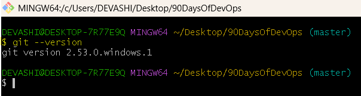
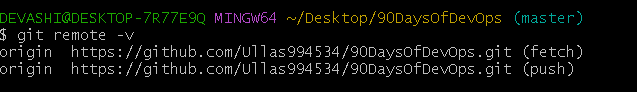
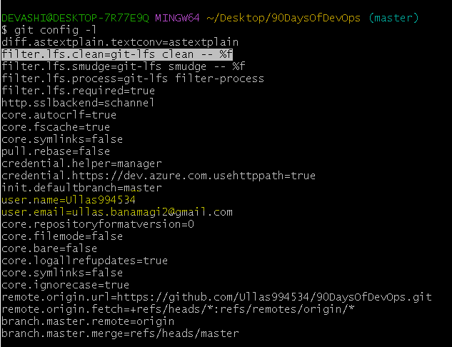
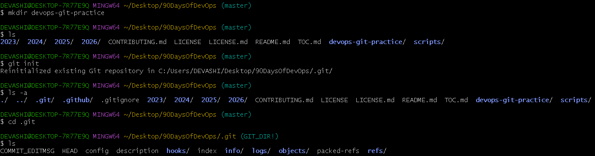
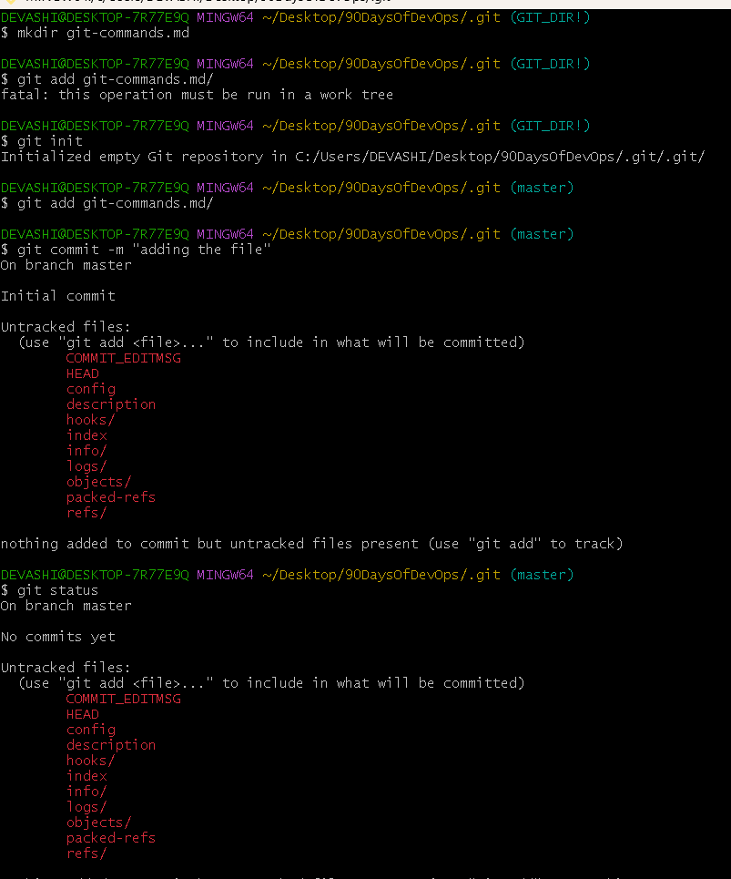
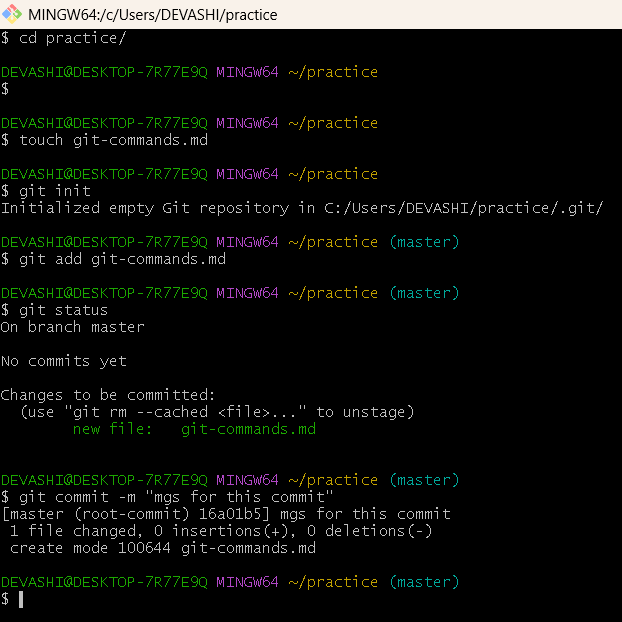
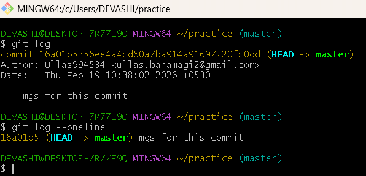

\### **Day 22 -- Introduction to Git: Your First Repository**

\## **Task 1: Install and Configure Git**

1)  Verify Git is installed on your machine.

Git --version

{width="5.0337696850393705in"
height="1.3417825896762905in"}

2)  Set up your Git identity --- name and email

git config \--global user.name \"username\"

git config \--global user.email \"email id\"

{width="5.3087937445319335in"
height="0.7667333770778653in"}

3)  Verify your configuration

{width="5.243910761154855in"
height="3.08203302712161in"}

\### **Task 2: Create Your Git Project**

1.  Create a new folder called devops-git-practice

2.  Initialize it as a Git repository

3.  Check the status --- read and understand what Git is telling you

4.  Explore the hidden .git/ directory --- look at what\'s inside

{width="6.5in" height="1.7118055555555556in"}

\## **Task 3: Create Your Git Commands Reference**

**Git add \<file name\> : Adds the specified file to the staging area so
it will be included in the next commit.**

**Git init -\> Initializes a new Git repository in the current directory
by creating a hidden .git folder.**

**Git status -\>** **Shows the current state of the repository (modified
files, staged files, untracked files).**

**Git commit -m "mgs for this commit" Saves the staged changes to the
repository with a descriptive commit message.**

**git log → Displays the history of commits made in the repository.**

{width="6.5in" height="7.811805555555556in"}

**\### Task 4: Stage and Commit**

1.  Stage your file

2.  Check what\'s staged

3.  Commit with a meaningful message

4.  View your commit history

{width="5.18378280839895in"
height="5.18378280839895in"}

**\### Task 5: Make More Changes and Build History**

1.  Edit git-commands.md --- add more commands as you discover them

2.  Check what changed since your last commit

3.  Stage and commit again with a different, descriptive message

4.  Repeat this process at least **3 times** so you have multiple
    commits in your history

5.  View the full history in a compact format

> {width="4.967097550306212in"
> height="2.400207786526684in"}
>
> **\## Task 6: Understand the Git Workflow**

1)  **What is the difference between git add and git commit?**

-   **git add** → Moves changes to the staging area (prepares them for
    saving).

-   **git commit →** Permanently saves the staged changes into the
    repository history.

2)  **What does the staging area do? Why doesn\'t Git just commit
    directly?**

> The **staging area** lets you choose exactly which changes to include
> in a commit.Git doesn't commit directly so you can organize changes
> into meaningful, clean commits instead of saving everything at once.

3)  **What information does git log show you?**

> git log shows:

-   Commit ID (SHA)

-   Author name

-   Date & time

-   Commit message

-   History order of commits

4)  **What is the .git/ folder and what happens if you delete it?**

-   The **.git/ folder** stores all repository data, commit history,
    branches, and configuration.

-   If you delete it, your project is no longer a Git repository and all
    commit history is lost.

5)  **What is the difference between a working directory, staging area,
    and repository?**

-   **Working Directory →** Where you edit your files.

-   **Staging Area →** Where you prepare selected changes for commit.

-   **Repository (.git) →** Where committed changes are permanently
    stored.
