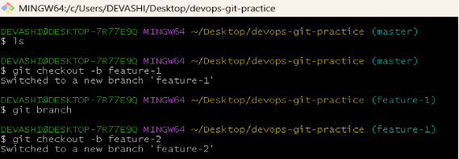
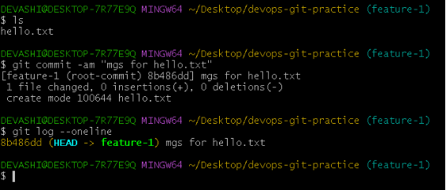
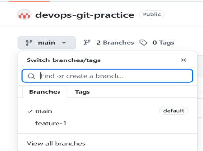
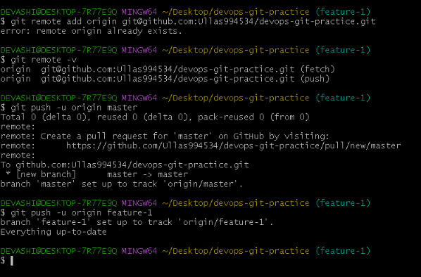

\### **Day 23 – Git Branching & Working with GitHub**

**## Task 1: Understanding Branches**

1) What is a branch in Git?

Ans: In Git, a branch is like a separate workspace where you can make changes and try new ideas without affecting the main project. Think of it as a "parallel universe" for your code.

1) Why do we use branches instead of committing everything to main?

Ans: Using branches instead of committing directly to the main branch is a fundamental best practice in software development because it isolates work, ensures code stability, and facilitates collaboration. Committing directly to main (the "production-ready" code) runs the high risk of breaking the application for everyone else and making it difficult to fix errors. 

1) What is HEAD in Git?

Ans: a symbolic reference (a pointer) to the **current commit** you are working on. It is essentially your current position in the project's history and determines the state of your working directory.

1) What happens to your files when you switch branches?

Ans: Untracked files in your working directory are not affected by the switch; they remain in the working directory as untracked files, unless they somehow conflict with the branch you're checking out.

**## Task 2: Branching Commands — Hands-On**

1. **List all branches in your repo**
1. **Create a new branch called feature-1**
1. **Switch to feature-1**
1. **Create a new branch and switch to it in a single command — call it feature-2**
1. **Try using git switch to move between branches — how is it different from git checkout?**
1. **Make a commit on feature-1 that does not exist on main**
1. **Switch back to main — verify that the commit from feature-1 is not there**
1. **Delete a branch you no longer need**
1. **Add all branching commands to your git-commands.md**

**## Task 3: Push to GitHub**

**Originà**  Is a conventional shorthand name (an alias) for the remote repository that a project was originally cloned from.

**Upstream**à refers to the original repository or the specific branch that your local repository or branch is tracking

\## **Task 4: Pull from GitHub.**

**Upstream à** refers to the original or main repository from which a project was forked or cloned. 

**Pull à** to fetch and merge the latest changes from the remote repository into your current local branch.

\## **Task 5: Clone vs Fork**

1) **What is the difference between clone and fork?**

Ans: fork à we will copying someone else repo into over own Github account

Clone à we will copying the github repo to over local machine, it is connected with remote.

1) **When would you clone vs fork?**

Ans: I will fork the repo from publicly available repos into my Github account and use it.

And clone if I want to local copy of a repo, I can work on it freely.

1) **After forking, how do you keep your fork in sync with the original repo?**

**Ans**: sync option is used when we have already cloned repo if they have did some changes in that repo so, then the sync fork option we reflecting in over github repo, so same changes can show in over github repo.

