\### **Day 24 – Advanced Git: Merge, Rebase, Stash & Cherry Pick**

\## **Task 1: Git Merge — Hands-On**

1) Create a new branch feature-login from main, add a couple of commits to it
1) ` `Switch back to main and merge feature-login into main
1) Observe the merge — did Git do a **fast-forward** merge or a **merge commit**?
1) Now create another branch feature-signup, add commits to it — but also add a commit to main before merging
1) Merge feature-signup into main — what happens this time?

` `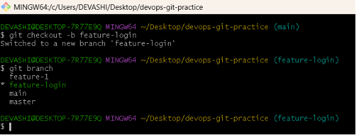

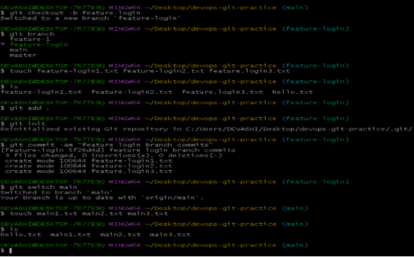

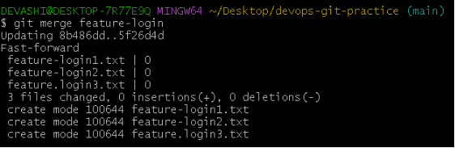

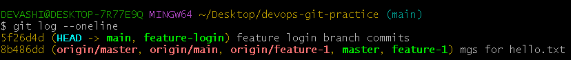

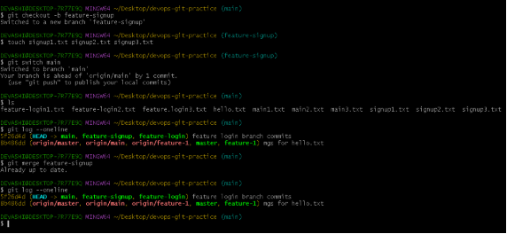

Answer in your notes:

- What is a fast-forward merge?

Ans: A type of merge operation where, instead of creating a new "merge commit", Git simply updates the pointer of the target branch to the latest commit of the source branch.

- When does Git create a merge commit instead?

Ans: Git creates a merge commit when the histories of the two branches being merged have **diverged**, or when explicitly instructed to do so. A merge commit is a special commit that has two (or more) parent commits, linking the two histories together

- **What is a merge conflict? (try creating one intentionally by editing the same line in both branches)**

Ans: Git event that occurs when competing changes are made to the same line(s) of a file in different branches, or when one person edits a file that another person deleted.

\## **Task 2: Git Rebase — Hands-On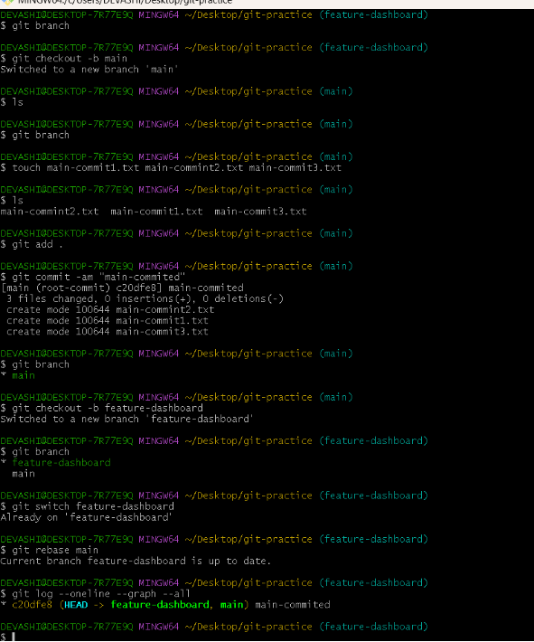**

\## Answer in your notes:

- What does rebase actually do to your commits?

Ans:  fundamentally rewrites your project history by moving, combining, or editing a sequence of commits to a new base commit, creating entirely new commits with different hashes.

- How is the history different from a merge?

Ans: A **merge** preserves the full, authentic history of how branches diverged and converged, while other methods—specifically **rebasing**—rewrite that history to create a cleaner, linear narrativ

- Why should you **never rebase commits that have been pushed and shared** with others?

Ans: Rebasing commits that have been pushed and shared is dangerous because it **rewrites commit history**, creating new hashes for existing commits. This causes "divergent history" where your local branch differs from the remote/teammates' branches, leading to difficult merge conflicts, lost work, and broken team workflows.

- **When would you use rebase vs merge?**

Ans: Rebase:  linear project history on personal or feature branches before sharing them, as it rewrites commit history by reapplying commits on top of another branch.

Merge: To combine shared, public branches, as it preserves the complete, chronological, and non-linear history of changes with a dedicated merge commit. 

**## Task 3: Squash Commit vs Merge Commit.**

- **Create a branch feature-profile, add 4-5 small commits & Merge it into main using --squash — what happens?**
- **a single commit history will be added to main for feature profile branch**

  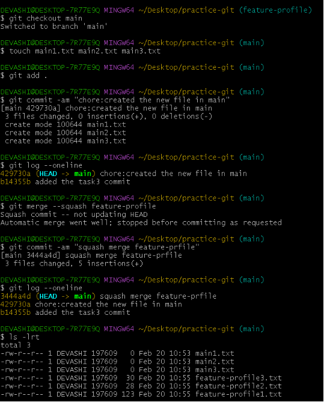

- **created another branch feature-settings, add a few commits**
- **Merge it into main without --squash**
- **This time feature setting branch merge into main branch with all new commit history of feature-setting branch.**

  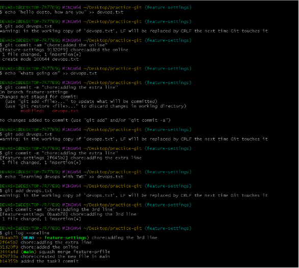

- **What does squash merging do.**

Ans: Takes all commits from a feature branch and compresses them into a single, new commit on the target branch (e.g., main) during a pull request.

- **When would you use squash merge vs regular merge**

Ans: squash merge: To condense feature branches with messy, incremental commits ("WIP," "fix typo") into a single, clean commit on the main branch, ideal for PRs.

Regular merge: To preserve the full, detailed history of how a feature was built, including all intermediate steps and developer context

- **What is the trade-off of squashing**

  Ans: one commit per feature

\### **Task 4: Git Stash — Hands-On**

1. Start making changes to a file but **do not commit**
1. Now imagine you need to urgently switch to another branch — try switching. What happens?

Ans: if I am trying to switch the branch it asking me to commit last changes or stash so I don’t want to commit a incomplete task so I stack i.e hide these changes then I will able to switch branch,

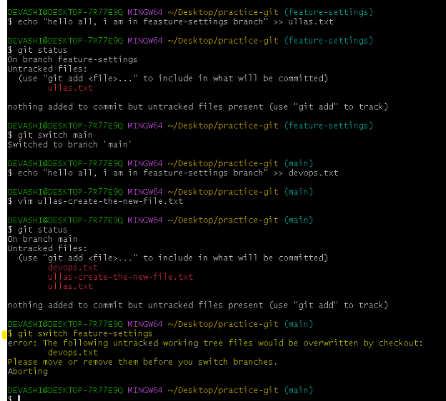

If we are switch the another branch, do other work, switch back and apply your stashed changes using git stash pop.

1. Use git stash to save your work-in-progress.

1. Switch to another branch, do some work, switch back
1. Apply your stashed changes using git stash pop
1. Try stashing multiple times and list all stashes
1. Try applying a specific stash from the list

   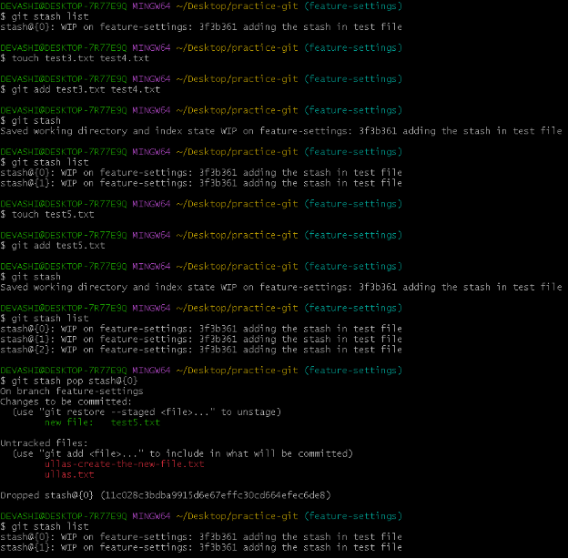

   8) Answer in your notes:

- What is the difference between git stash pop and git stash apply?
- **Git stash pop** : applies stash changes to your working directory and deletes the stash entry.
- **Git stash apply** : applies stash changes to your working directory but keeps the stash entry.
- When would you use stash in a real-world workflow?

- It another worker comes, so I can use the stash changes from my current branch and switch to another branch to work on urgent fix first.

  **## Task 5: Cherry Picking**

1. Create a branch feature-hotfix, make 3 commits with different changes
1. Switch to main
1. Cherry-pick only the second commit from feature-hotfix onto main
1. Verify with git log that only that one commit was applied

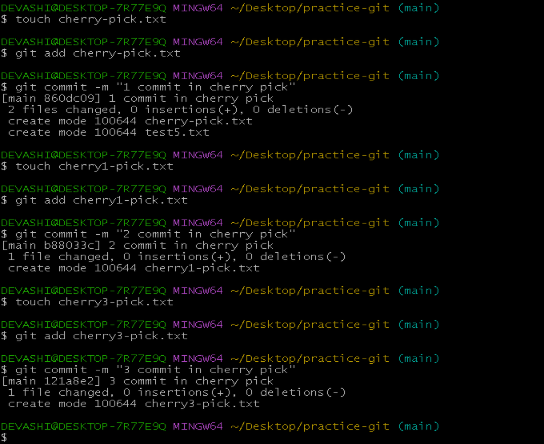

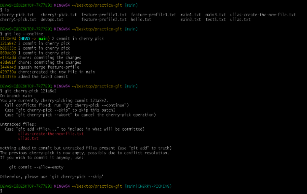

\8) Answer in your notes:

- What does cherry-pick do?

Ans: Cherry picking is the act of picking a commit from a branch and applying it to another. git cherry-pick can be useful for undoing changes. For example, say a commit is accidently made to the wrong branch.

- When would you use cherry-pick in a real project?

Ans: if I made multiple commits, but I wrongly one changes to be applied to main branch, then I Then I would cherry-pick that single commit instead of merging the whole branch.

- What can go wrong with cherry-picking?
- Ans: Cherry-picking can create duplicate commits if the same branch is later merged, leading to a messy commit history.
- It can also cause conflicts when the selected commit depends on changes from previous commits that are not included.

