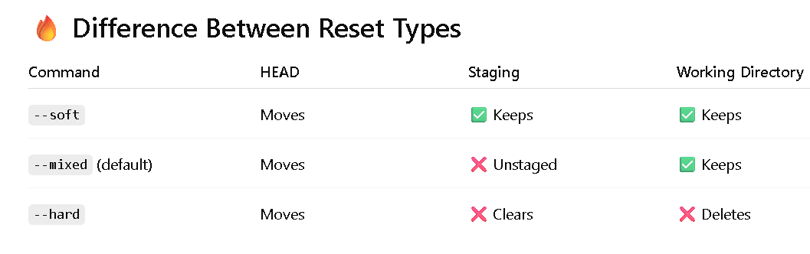
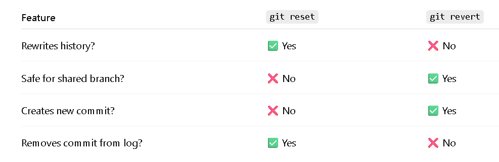
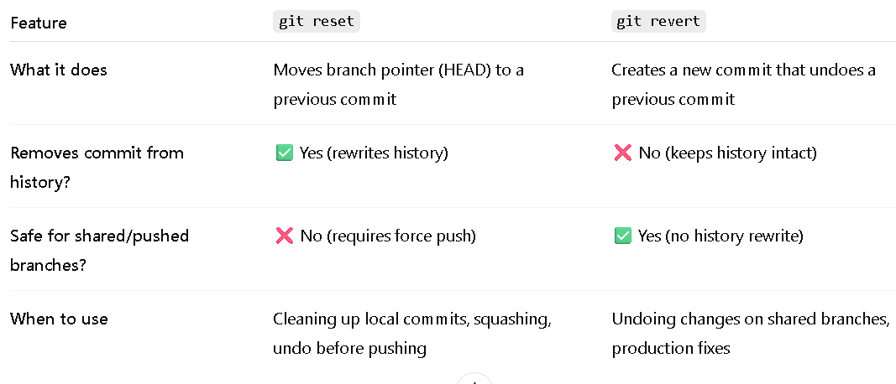
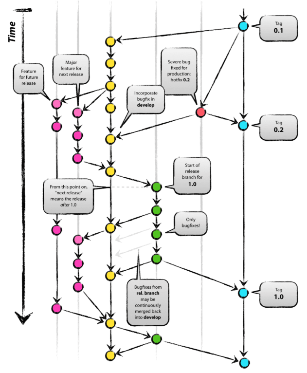

\### **Day 25 -- Git Reset vs Revert & Branching Strategies**

**Challenge Tasks**

**Task 1: Git Reset --- Hands-On**

-   Make 3 commits in your practice repo (commit A, B, C)

-   Use git reset \--soft to go back one commit --- what happens to the
    changes?

```{=html}
<!-- -->
```
-   Move **HEAD** back one commi

-   Keep your files in the **working directory**

-   Keep your changes in the **staging area**

> ❌ It does NOT delete anything\
> ❌ It does NOT unstage anything

-   Re-commit, then use git reset \--mixed to go back one commit ---
    what happens now?

Ans: (\--mixed) moves the **HEAD** back **and unstages your changes**,

but keeps your actual file changes safe in your working directory.

-   Re-commit, then use git reset \--hard to go back one commit --- what
    happens this time?

```{=html}
<!-- -->
```
-   You edited 10 files

-   You forgot to commit

-   You run: git reset --hard ALL uncommitted changes are permanently
    deleted.

-   Answer in your notes:

-   What is the difference between \--soft, \--mixed, and \--hard?

{width="6.111755249343832in"
height="1.63167760279965in"}

-   Which one is destructive and why?

Ans: git reset \--hard is destructive because it resets the commit
history, staging area, and working directory --- permanently deleting
uncommitted and staged changes.

-   When would you use each one?

```{=html}
<!-- -->
```
-   Do I just want to change the commit?\" → **\--soft**

```{=html}
<!-- -->
```
-   \"Do I want to re-edit my changes?\" → **\--mixed**

-   \"Do I want to delete everything?\" → **\--hard**

```{=html}
<!-- -->
```
-   Should you ever use git reset on commits that are already pushed?

Ans: You should avoid using git reset on pushed commits because it
rewrites shared history and requires force-pushing, which can disrupt
collaborators. Instead, use git revert for changes on shared branches.

**\## Task 2: Git Revert --- Hands-On**

1.  **Make 3 commits (commit X, Y, Z)**

2.  **Revert commit Y (the middle one) --- what happens?**

**Ans: When you revert a middle commit (Y), Git creates a new commit
that undoes Y's changes. Commit Y still remains in the history. The
history is preserved; only its effect is reversed.**

3.  **Check git log --- is commit Y still in the history?**

**Ans: Yes, git revert adds a new commit that undoes the changes from
specified commit and keeps the original commit.**

**Answer in your notes:**

-   **How is git revert different from git reset?**

{width="6.2796019247594055in"
height="1.7835826771653542in"}

-   **Why is revert considered safer than reset for shared branches?**

> **Ans**: Because it preserves history.

-   When would you use revert vs reset?

```{=html}
<!-- -->
```
-   **git revert** when working on shared branches or pushed commits
    because it safely undoes changes without rewriting history.

```{=html}
<!-- -->
```
-   **git reset** when working locally and you want to modify, remove,
    or reorganize commits before sharing them.

> \## **Task 3: Reset vs Revert --- Summary.**
>
> {width="6.275558836395451in"
> height="2.495406824146982in"}

1.  **GitFlow --- develop, feature, release, hotfix branches**

**Ans:** GitFlow uses main for **production**, **develop** for
integration, **feature** branches for new work, release branches for
pre-production stabilization, and **hotfix** branches for urgent
production fixes. It is ideal for structured release cycles and large
teams.

2.  **GitHub Flow** --- simple, single main branch + feature branches

GitHub Flow is a simple branching strategy that uses a single main
branch and short-lived feature branches. All changes are made in feature
branches, reviewed via pull requests, and merged back into main, which
remains production-ready at all times.

3.  **Trunk-Based Development** --- everyone commits to main,
    short-lived branches

Trunk-Based Development is a branching strategy where developers either
commit directly to the main branch or use very short-lived feature
branches. It encourages frequent integration, strong CI practices, and
small incremental changes to keep the main branch always releasable.

{width="5.262439851268591in"
height="5.481549650043744in"}

Answer :

-   Which strategy would you use for a startup shipping fast?

For a startup focused on fast shipping and continuous delivery, I would
use Trunk-Based Development or GitHub Flow. They are simple, reduce
merge conflicts, and support rapid integration and deployment. GitFlow
is usually too heavy for early-stage teams.

-   Which strategy would you use for a large team with scheduled
    releases?

For a large team with scheduled releases, I would use GitFlow because it
provides structured branch management with separate development,
release, and hotfix branches. This allows parallel feature development,
controlled testing phases, and stable production releases.

-   Which one does your favorite open-source project use? (check any
    repo on GitHub).

> In Trunk-Based Development, developers commit directly to the main
> branch or use very short-lived branches that are merged quickly to
> keep the main branch always releasable.
