**\### Day 26 -- GitHub CLI: Manage GitHub from Your Terminal.**

**\## Challenge Tasks**

**\## Task 1: Install and Authenticate**

1.  **Install the GitHub CLI on your machine**

2.  **Authenticate with your GitHub account**

3.  **Verify you\'re logged in and check which account is active**

4.  **Answer in your notes: What authentication methods
    does gh support?**

> 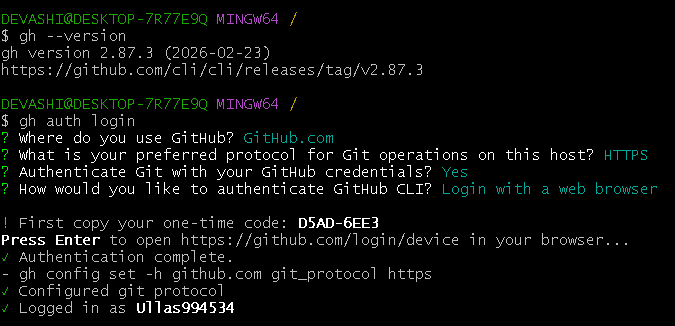{width="5.6293919510061246in"
> height="2.4564621609798776in"}
>
> 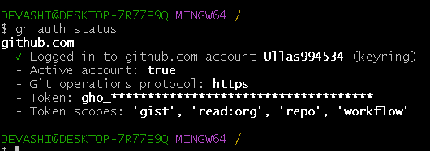{width="5.461678696412949in"
> height="1.5603718285214347in"}

**\## Task 2: Working with Repositories**

1.  **Create a new GitHub repo directly from the terminal --- make it
    public with a README**

2.  **Clone a repo using gh instead of git clone**

3.  **View details of one of your repos from the terminal**

4.  **List all your repositories**

5.  **Open a repo in your browser directly from the terminal**

6.  **Delete the test repo you created (be careful!)**

> 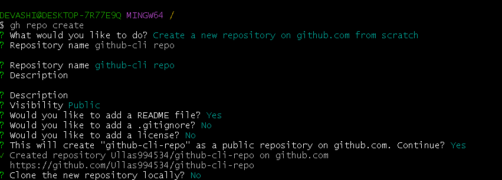{width="6.5in" height="2.3375in"}
>
> 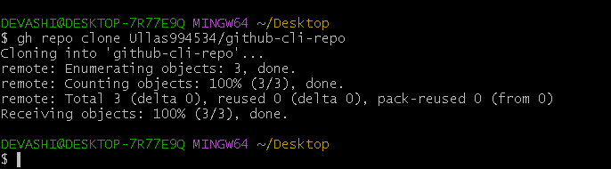{width="5.735110454943132in"
> height="1.459238845144357in"}
>
> 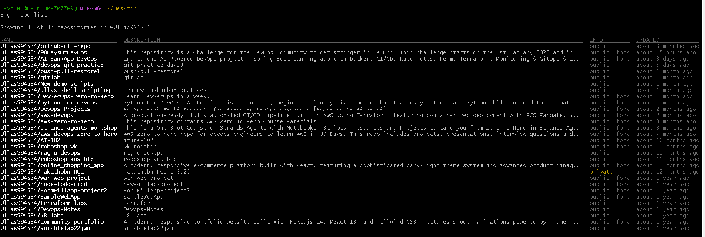{width="6.504277121609799in"
> height="2.5168055555555555in"}
>
> 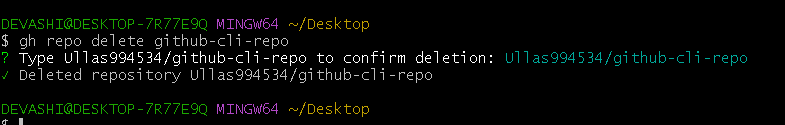{width="6.5in" height="1.0347222222222223in"}

**\## Task 3: Issues.**

1.  **Create an issue on one of your repos from the terminal --- give it
    a title, body, and a label**

2.  **List all open issues on that repo**

3.  **View a specific issue by its number**

4.  **Close an issue from the terminal**

5.  **Answer in your notes: How could you use gh issue in a script or
    automation?**

6.  **By combining gh issue commands in a script, you can automate
    workflows such as:**

    1.  **gh issue list**

    2.  **gh issue comment**

    3.  **gh issue close**

> 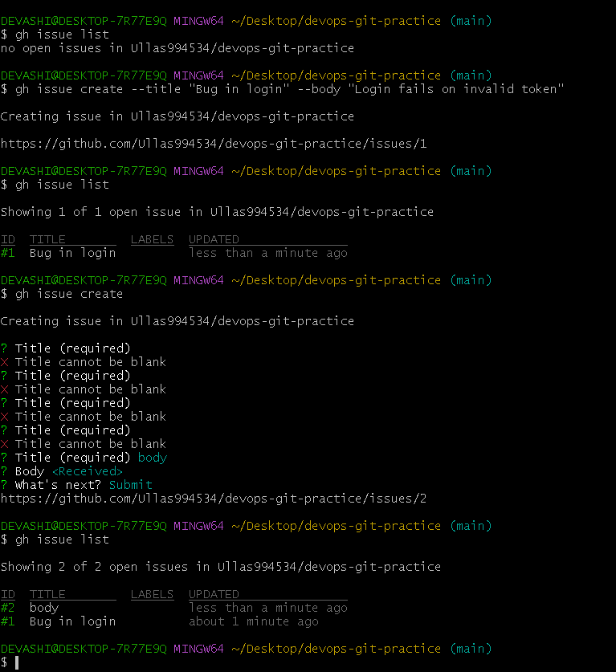{width="6.405652887139108in"
> height="4.851613079615048in"}

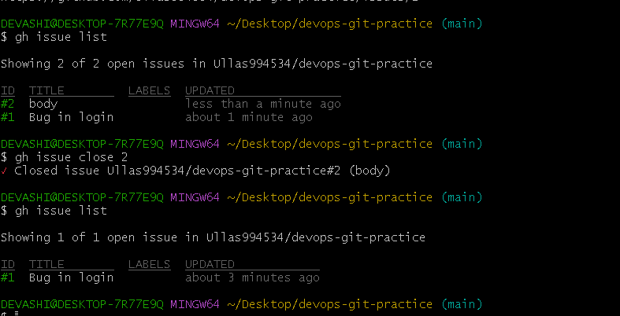{width="6.5176990376202975in"
height="2.758442694663167in"}

**Task 4: Pull Requests**

1.  Create a branch, make a change, push it, and create a **pull
    request** entirely from the terminal

2.  List all open PRs on a repo

3.  View the details of your PR --- check its status, reviewers, and
    checks

4.  Merge your PR from the terminal

> 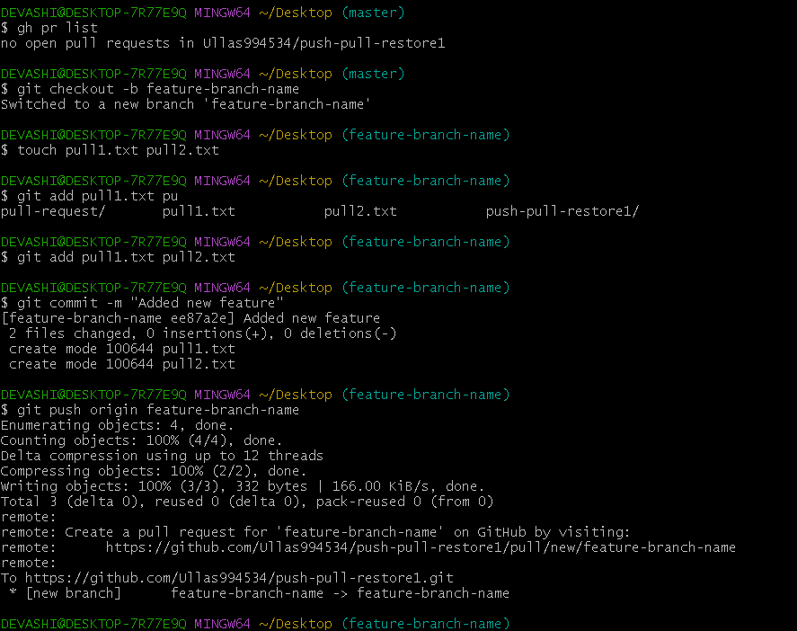{width="6.507338145231846in"
> height="4.066200787401574in"}
>
> 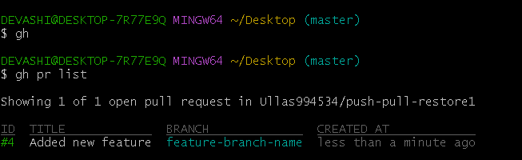{width="5.4421380139982505in"
> height="1.6668110236220472in"}
>
> 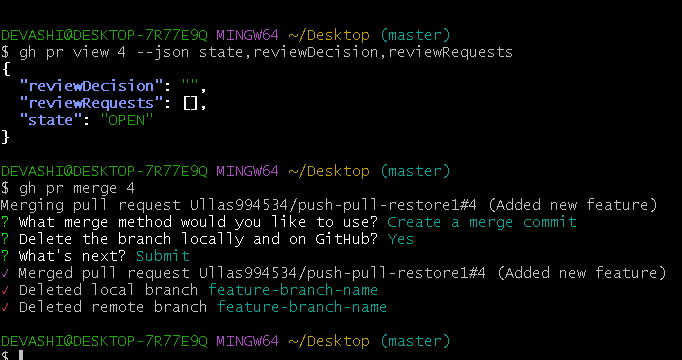{width="5.683825459317585in"
> height="3.0002602799650044in"}

1.  Answer in your notes:

    -   What merge methods does gh pr merge support?

        -   merge commit

        -   rebase merge

        -   squash merge

    -   How would you review someone else\'s PR using gh?

        -   gh pr view \--web

        -   gh pr review \<pr-num\> \--approve

**\## Task 5: GitHub Actions & Workflows (Preview)**

1.  List the workflow runs on any public repo that uses GitHub Actions

2.  View the status of a specific workflow run

3.  Answer in your notes: How could gh run and gh workflow be useful in
    a CI/CD pipeline

> **Why gh run and gh workflow are useful in CI/CD**

-   **Quick status checks:** View workflow results without opening the
    browser.

-   **Automation scripts:** Integrate these into scripts to monitor or
    act on CI status.

-   **Debugging:** Fetch logs and run details from CLI for faster
    troubleshooting.

-   **Workflow management:** Enable/disable or list workflows easily
    with gh workflow.

> 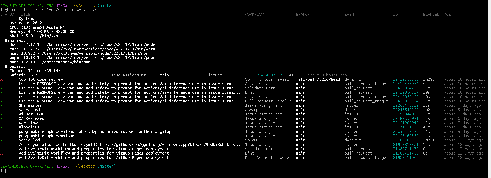{width="6.805378390201225in"
> height="2.5381364829396325in"}
>
> **\## Task 6: Useful gh Tricks**

-   **gh api --** Make raw GitHub API requests directly from the
    terminal for automation and advanced scripting.

-   **gh gist --** Create and manage GitHub Gists quickly from the
    command line.

-   **gh release** -- Create, view, and manage repository releases
    without using the browser**.**

-   **gh alias** -- Create custom shortcuts for frequently used GitHub
    CLI commands.

-   **gh search repos --** Search GitHub repositories directly from the
    terminal.
